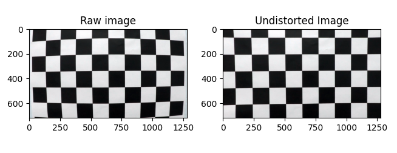
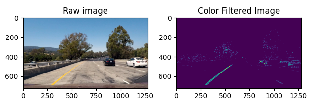
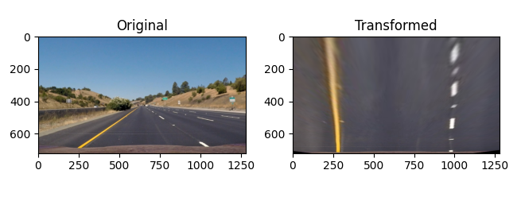
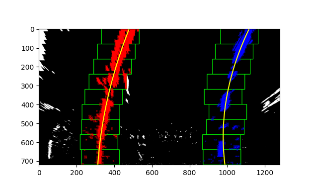
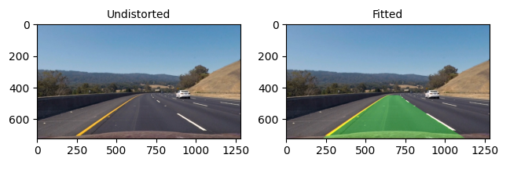

## Advanced Lane Finding

---

**Advanced Lane Finding Project**

The goals / steps of this project are the following:

* Compute the camera calibration matrix and distortion coefficients given a set of chessboard images.
* Apply a distortion correction to raw images.
* Use color transforms and gradients to create a thresholded binary image.
* Apply a perspective transform to rectify binary image ("birds-eye view").
* Detect lane pixels and fit to find the lane boundary.
* Determine the curvature of the lane and vehicle position with respect to center.
* Warp the detected lane boundaries back onto the original image.
* Output visual display of the lane boundaries and numerical estimation of lane curvature and vehicle position.

Each section (calibration and each pipeline step) has its own bazel target that can be used to generate the listed image.

[//]: # (Image References)

[image0]: ./images/gradient.png "Gradient filtering"

---

### Camera Calibration

The class Calibration is in charge of performing the camera calibration and undistortion. Upon construction the number
of points in the checkerboard are passed in (i.e. `Calibration(9,6)`). By performing subsequent calls to the Update
function with each image in the calibration set we generate and store the image (`self.image_points_`) and object points
(`self.object_points_`); the first being the corner positions in the image (pixels) and the latter bing the corner
positions in the world.

```python
for image_name in files:
    img = cv2.imread(image_name)
    gray = cv2.cvtColor(img, cv2.COLOR_BGR2GRAY
    calibration.Update(gray)
```

The Calibrate function passes all the collected object and image points to the `cv2.calibrateCamera` function
to calculate the calibration matrix and the distortion coefficients. Finally, the Undistort function uses the stored
matrics and coefficients to undistort an argument image.

```python
def Undistort(self, image):
    return cv2.undistort(image, self.matrix_, self.distortion_coefficients_, None, self.matrix_)
```

<p align="center">
    
</p>

Note: bazel run //advanced_lane_finder:test_calibration

### Pipeline Steps

The following sections describe the differen steps that form the full processing pipeline. Unless stated otherwise an
independent class was written for each step.


### Color Transform

The transformation into the HLS colorspace is performed by the Color class. Upon instantiation of a Color object the
transformation is directly performed; only the S channel is saved. Using the `Filter` function it is possible to provide
lower and upper thresholds to perform the filtering on the S channel.

```python
self.s_ = cv2.cvtColor(img, cv2.COLOR_RGB2HLS)[:, :, 2]
```

<p align="center">
    
</p>

Note: bazel run //advanced_lane_finder:test_color

### Gradient Filtering

The class gradient performs the sobel computation on an image (`CalculateGradient`) and stores both the horizontal and
vertical components.

```python
def CalculateGradient(self, img):
    gray = cv2.cvtColor(img, cv2.COLOR_RGB2GRAY)
    self.x_ = cv2.Sobel(gray, cv2.CV_64F, 1, 0, ksize=self.kernel_size_)
    self.y_ = cv2.Sobel(gray, cv2.CV_64F, 0, 1, ksize=self.kernel_size_)
```

The gradient is calculated using the `Sobel` function of openCV; this function expects the
direction to be used and the kernel size. Using the functions `AbsoluteThreshold`, `MagnitudeThreshold` and
`DirectionThreshold` the image can be filtered. The results of this procedures along with color filtering can be then
combined.

![image0]

For the actual pipeline the following combination of direction, magnitude, absolute and colore thresholding was used:

```python
    combined[
        ((abs_threshold[0] == 1) | ((mag_threshold == 1) & (dir_threshold == 1)))
        | (self.filtered_ == 1)
    ] = 1
```

Note: bazel run //advanced_lane_finder:test_gradient

### Perspective Transform

There are three classes that play a role in the perspective transformation. The first of them is the Trapezoid class; it
simply groups the four points (x, y coordinates) that describe a trapezoid. By defining a source trapezoid and a
destination one we can instantiate a Transformation object; once again just a grouping of the two. The following were
used for the transformation.

```python
src_p0 = Point(165, 720)
src_p1 = Point(550, 480)
src_p2 = Point(730, 480)
src_p3 = Point(1115, 720)

src_trp = Trapezoid(src_p0, src_p1, src_p2, src_p3)

dst_p0 = Point(250, 720)
dst_p1 = Point(250, 460)
dst_p2 = Point(980, 460)
dst_p3 = Point(980, 720)

dst_trp = Trapezoid(dst_p0, dst_p1, dst_p2, dst_p3)
```

The actual perspective calculations are done in the Perspective class; instatiation calculates the perspective
transform and the inverse perspective transform.

```python
class Perspective:
    def __init__(self, transformation):
        self.transformation_ = transformation
        self.m_ = cv2.getPerspectiveTransform(self.transformation_.GetSource(), self.transformation_.GetDestination())
        self.m_inv_ = cv2.getPerspectiveTransform(
            self.transformation_.GetDestination(), self.transformation_.GetSource()
        )
```

Then `Transform` can be used to warp the image and `InverseTransform` can be used to warp it back; these functions use
the `warpPerspective` function of openCV, which expects the aforementioned transforms.

```python
    def Transform(self, img):
        img_size = (img.shape[1], img.shape[0])
        return cv2.warpPerspective(img, self.m_, img_size, flags=cv2.INTER_LINEAR)

    def InverseTransform(self, img):
        img_size = (img.shape[1], img.shape[0])
        return cv2.warpPerspective(img, self.m_inv_, img_size, flags=cv2.INTER_LINEAR)
```

<p align="center">
    
</p>

Note: bazel run //advanced_lane_finder:test_perspective


#### Polyline Detection

The Lines class handles the lane boundary detection, the fitting to second degree polynomials and the superposition on the
original image.

For the first frame of the video a histogram is calculated. By find the maximum points to the left and
right of the center of the image tentative starting points to look for the boundary lanes are calculated. From these
starting points we build search windows; the height of which is defined by `image_height / number_of_windows` whereas
the width is a configured parameter. For each window the non-zero pixels are found with the function
`__FindValidIndices__`; if the number of valid pixels is greater than `self.minimum_hits_` the center for the next
window is possitioned there. This is repeated for each window until the top of the image.

<p align="center">
    
</p>

For each subsequent frame in the video the search is started from the polyline fit to the previous frame and a margin to
either side. This is performed in the function `LookBack`; a slight modification of the `search_around_poly` function.

The polylines are then plotted on top of the image and the image is warped back using the `InverseTransform` function in
the Perspective class.

Note: bazel run //advanced_lane_finder:test_lines

#### Curvature and offset from Centerline

The curvature computation is performed on the real-world polynomials by using the first and second derivatives as shown
below:

$$ R_{curve} = \frac{[1 + \frac{dy}{dx} ^ 2]^{3/2} }{ | \frac{d^2y}{dx^2} |} $$

Where the derivatives for y in terms of x are:

$$ f'(y) = 2Ay + B $$
$$ f''(y) = 2A $$

which translates to

$$ R_{curve} = \frac{[1 + (2Ay + B) ^ 2]^{3/2} }{ | 2A |} $$

This can be seen in the class Lines in the function `CalculateCurvature`.

```python
    def CalculateCurvature(self, polynomial_fit, y, ym_per_pix=(30 / 720)):
        numerator = (1 + (2 * polynomial_fit[0] * y * ym_per_pix + polynomial_fit[1]) ** 2) ** (3 / 2)
        denominator = abs(2 * polynomial_fit[0])
        return numerator / denominator
```

The offset from the centerline is calculated by measuring the average of bottom points of both boundary polynomials and
then substracting from it the center of the image. This is then converted back to real world measurements. The function
`CalculateOffsetFromCenter` in the Lines class performs this calculation.

```python
    def CalculateCurvature(self, polynomial_fit, y, ym_per_pix=(30 / 720)):
        numerator = (1 + (2 * polynomial_fit[0] * y * ym_per_pix + polynomial_fit[1]) ** 2) ** (3 / 2)
        denominator = abs(2 * polynomial_fit[0])
        return numerator / denominator
```

#### Full image pipeline

The Pipeline class uses all the classes described in the previous section to process a single image (or a frame in a
video). The `Prepare` function performs the camera calibration and initializes the perspective transformation and the
`Process` function calls each element in the pipeline one after another, merges the results together and calculates the
curvature and offset from the centerline. The merging method is presented once again below:

```python
    combined[
        ((abs_threshold[0] == 1) | ((mag_threshold == 1) & (dir_threshold == 1)))
        | (self.filtered_ == 1)
    ] = 1
```

<p align="center">
    
</p>

Note: bazel run //advanced_lane_finder:test_pipeline

---

### Pipeline (video)

It can be generated using `bazel run //advanced_lane_finder:test_video_pipeline`.

Here's a [link to my video result](https://github.com/moisesejimenezg/car_nd_project_02/blob/master/advanced_lane_finder/data/output_video/processed_project_video.mp4)

---

### Discussion

One of the biggest issues faced was handling stretches of the road where it has a lighter color, as is the case in the
project video. The solution was to lower the lower threshold used in color filtering.

Also under some configurations it can be the case that one of the lane boundaries is lost and since the subsequent ones
are calculated from the system is unable to recover. Measuring the quality of the fitted polynomial and then maybe
reverting to the windows approach could be a sensible approach.
